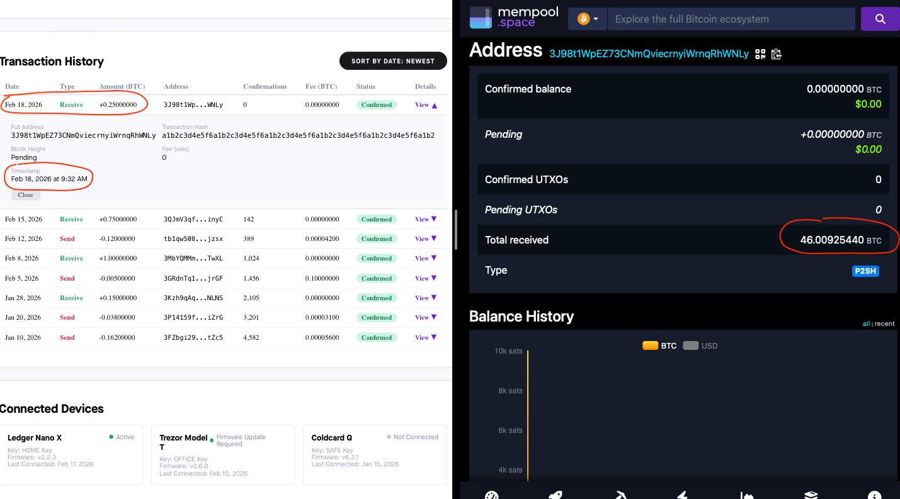
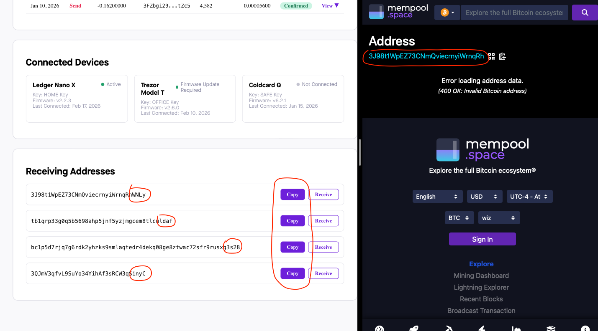
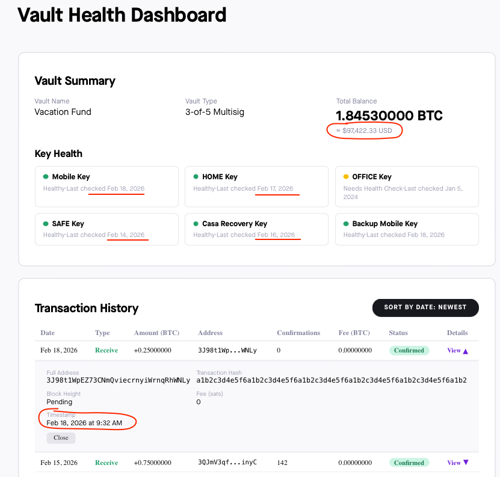
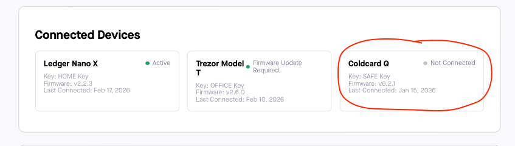

```sh
# Casa Vault Health Dashboard Assessment

## Overview
This repository contains a technical assessment for the QA Engineer role at Casa. It demonstrates a risk-based testing approach for a Bitcoin vault dashboard, focusing on data reconciliation, hardware status, and critical UI functional paths.

---

## Quick Start

1. Clone the repo:
   git clone https://github.com/boldaslions/casa-qa-engineer-assessment.git

2. Install dependencies:
   npm install

3. Run automated tests:
   npx playwright test

4. View test report:
   npx playwright show-report

---

## Part 1: Automated Tests
The test suite utilizes Playwright to validate critical functional paths. The primary test ensures that the "Copy" feature captures the full address string to prevent financial loss.

* Key Coverage: Address Copy Integrity, Authentication Redirects, and Component Visibility.
* Framework: Playwright (TypeScript)

---

## Part 2: Bug Documentation

### A. Blocker: Massive BTC Balance Reconciliation Failure
* Description: Comparing the transaction history for address 3J98t1Wp...WNLy on the dashboard against a live block explorer reveals a massive discrepancy.
* Expected Behavior: Dashboard must accurately reflect the total BTC received (~46.009 BTC).
* Actual Behavior: Dashboard only reports 0.25 BTC, failing to account for over 45.75 BTC confirmed on-chain.
* Impact: Blocker. Total failure of asset visibility and financial reporting.
* Evidence:


---

### B. Critical: Receiving Address Truncation (Last 4 Characters)
* Description: The "Copy" button systematically clips the final 4 characters of the Bitcoin address.
* Steps to Reproduce: Click "Copy" for a receiving address and paste into any text editor.
* Actual Behavior: 3J98t1WpEZ73CNmQviecrnyiWrnqRhWNLy becomes 3J98t1WpEZ73CNmQviecrnyiWrnqRh.
* Impact: Critical. Leads to invalid transactions and potential irrecoverable loss of funds.
* Evidence:


---

### C. High: Outdated Market Valuation and Stale Status
* Description: USD valuations and transaction confirmation statuses are significantly outdated.
* Actual Behavior: USD price is stale by 21+ days; transactions remain "Pending" despite having hundreds of confirmations on-chain.
* Evidence:


---

### D. Medium: Hardware Device Status Discrepancy
* Description: Coldcard Q displays "Not Connected" since Jan 15, while other keys show recent health checks.
* Evidence:


---

## Part 3: AI Tooling
* Tools Used: Claude 3.5 Sonnet / Gemini 3 Flash.
* Implementation: Leveraged AI for Playwright boilerplate generation, CSS selector optimization, and refining technical documentation.

---

## License
This project is licensed under the MIT License.
```
